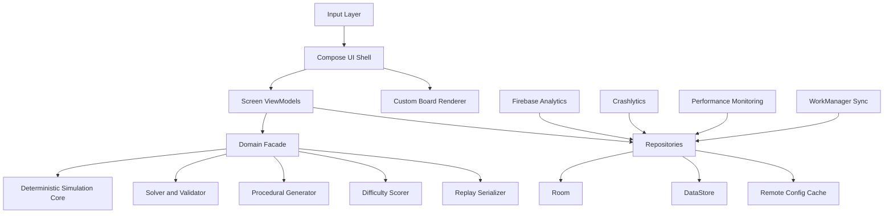
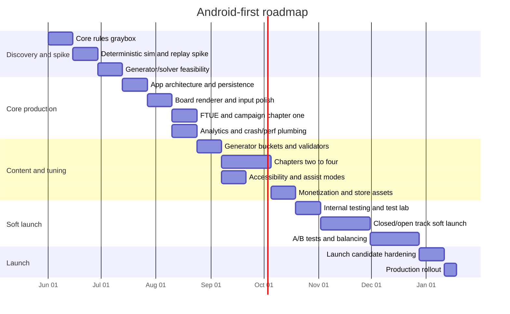

# Native Android Product Brief and Development Plan for a Procedural Arrow Puzzle Game

## Executive summary

The strongest product and engineering approach for this concept is a **native Android game with a deterministic pure-Kotlin simulation core**, **Jetpack Compose for shell UI**, and a **custom board renderer using Compose Canvas or a custom drawing surface**. That recommendation is an inference from the mechanic itself: this game is a constrained, grid- or node-based 2D puzzle with low asset complexity, heavy need for exact simulation, and significant value from Android-native UI, testing, accessibility, analytics, and release tooling. Compose is Google’s recommended modern Android UI toolkit and supports custom drawing, while Android architecture guidance, ViewModel-based state holders, DataStore, Room, Macrobenchmark, and Baseline Profiles fit this project well. citeturn11search7turn30search2turn30search10turn13search2turn13search14turn13search0turn3search1turn3search3turn4search17

For procedural generation, the recommended design is a **hybrid generator**: a **constructive backbone** that assembles solvable candidate boards, followed by an **exact validator/solver** and a **rejection-or-repair pass** driven by difficulty and “interestingness” metrics. That recommendation is well aligned with the puzzle-generation literature: surveys of procedural puzzle generation emphasize the central difficulty of guaranteeing solvability and controlling quality; constraint-focused methods such as ASP/CSP are strong where hard guarantees matter; simulated-play approaches can guarantee solvability when generation proceeds through legal gameplay; and puzzle quality depends not only on solvability but also on constraining undesirable alternate solutions. citeturn22view0turn22view2turn22view1turn31view0turn28view0

Commercially, the cleanest initial strategy is **free-to-download with optional rewarded features, a one-time ad-removal / premium upgrade, and optional puzzle-pack or cosmetic purchases**, not a subscription-first model. Google Play Billing supports one-time purchases and subscriptions, AdMob supports rewarded and rewarded-interstitial formats, and Firebase Remote Config plus A/B Testing gives a practical mechanism for tuning onboarding, ad cadence, and monetization during soft launch. For later iOS expansion, the safest long-term architecture is **Android-first with a shared Kotlin Multiplatform gameplay core**, then a native iOS shell using SwiftUI Canvas or SpriteKit depending on animation complexity. citeturn9search11turn9search4turn8search1turn7search1turn7search0turn11search1turn11search0turn34search0turn34search9turn34search16

The immediate next action should be a **six-week graybox spike** that proves three things before full production: the feel of the tap-and-release loop, the correctness and speed of the deterministic solver/validator, and the retention impact of the three-collision forgiveness system versus stricter modes. That de-risks design, generation, and technical architecture at the same time. citeturn22view1turn24view4turn24view1turn7search0

## Product brief

The cleanest expression of the mechanic is to treat the puzzle as a **deterministic scheduling-and-routing game on a directed board**. Each board contains stationary arrow pieces with fixed facing. Tapping an idle arrow activates it and sends it along its direction at constant speed. Activated arrows continue moving until they exit, reach a sink/goal, or collide with another active arrow. The player’s problem is therefore not aim, but **ordering, timing, and interference management**. That framing makes the puzzle understandable, exactly simulable, and compatible with solver-backed PCG. It also matches how puzzle-generation research distinguishes solvability from deeper qualities such as difficulty, constraint satisfaction, and absence of undesirable shortcuts. citeturn22view0turn22view2turn31view0turn24view4

A good launch configuration is a **campaign-plus-endless hybrid**. The campaign should begin with a short curated FTUE and hand-authored chapter intros, then transition into seeded procedural boards once the player understands the grammar. This mirrors the literature’s emphasis on using difficulty curves and controlled progression when new mechanics are introduced, rather than relying on uncontrolled randomness from the start. The endless layer can then provide daily seeds, streak play, and challenge ladders without blocking the campaign’s clarity. citeturn24view1turn22view3turn7search3

The **three-collision system** should remain the default for broad-market play. It is a retention mechanic, not the central challenge. The player clears a level if all arrows are removed before the third collision; the third collision ends the run. That suggests three design consequences. First, collisions should feel legible and fair, with immediate pause, strong feedback, and unambiguous life loss. Second, “perfect clear” should mean **zero collisions**, because the three-heart buffer lowers frustration but should not erase mastery. Third, harder modes should tighten the rule set rather than inflate board size: for example, “Precision” with one allowed collision, and “Zen/Turn-Based Assist” with lower speed and preview tools. This preserves one coherent ruleset while broadening accessibility and mastery. This is a design recommendation rather than a claim from a source, but it is consistent with the literature’s distinction between solvability, perceived difficulty, and progression tuning. citeturn24view1turn22view1turn22view0

The UI should prioritize **clarity over decoration**. Use a nearly full-screen board, a minimal top HUD for remaining arrows, collisions used, and pause/settings, and a bottom or corner cluster for optional booster actions only if those systems exist. Because new Android releases enforce edge-to-edge behavior for apps targeting recent SDKs, the layout must handle insets correctly from the start. Interactive elements should meet Android accessibility guidance for touch target size, Compose semantics, and descriptive labels. For a puzzle board rendered with custom drawing, each logical arrow should still expose semantic identity and interactable bounds for testing and accessibility services. citeturn29search0turn10search4turn10search8turn10search1turn10search2turn10search5

Scoring should separate **progression**, **mastery**, and **competition**. Campaign progression should use stars or medals, not raw score alone: three stars for zero collisions, two for one collision, one for two collisions, fail on the third. A secondary numeric score can drive leaderboards and daily challenge placement. The numeric layer should be derived from normalized terms such as completion time, tap count relative to a solver baseline, collisions, and chapter modifier. This follows a broader research pattern in which puzzle difficulty and evaluation are better handled by combining multiple metrics than by relying on any single signal. citeturn22view3turn24view0turn22view1

Progression should introduce mechanics in a controlled grammar. A sensible chapter plan is: **basics**, **obstacles**, **rotators**, **timed gates**, **splitters**, **portals**, **locks/keys**, **mixed-system boards**. The difficulty curve should rise primarily through interaction density, order-dependence, and simultaneity, not only through board size. Research on puzzle difficulty estimation repeatedly points toward feature combinations such as search depth, mechanics variety, duplicate-solution structure, and congestion rather than crude content volume alone. citeturn22view3turn24view0turn24view2turn24view3

The recommended monetization fit is below. The table is a synthesis of platform capabilities and business fit, not a quotation from a single source. Google Play Billing supports one-time products and subscriptions, AdMob supports rewarded formats including extra-life style rewards, and Apple StoreKit provides the equivalent iOS purchase layer for later porting. citeturn9search11turn9search4turn8search1turn34search3turn34search7

| Monetization model | Fit for this game | Strengths | Main risks | Recommendation |
|---|---|---|---|---|
| Paid upfront premium | Moderate | Clean UX, no ad pressure, strong positioning for a polished puzzle game | Harder acquisition on mobile stores | Viable only with very strong brand/art and no live-ops dependence |
| Free + rewarded ads + remove-ads purchase | High | Broad reach, rewarded ads map naturally to hints/revives/extra run protection | Can damage quiet puzzle feel if overused | Best launch baseline |
| Free + hint packs / cosmetic themes / chapter DLC | High | Aligns monetization with value, low design distortion | Requires enough content breadth | Strong secondary layer |
| Subscription | Low to moderate | Predictable revenue if daily content is substantial | Poor fit without very strong daily utility and content cadence | Do not lead with this |
| Aggressive interstitial-heavy free-to-play | Low | Short-term ARPU potential | High churn risk, poor reviews, degrades puzzle tone | Avoid |

Accessibility should be designed into the first milestone, not bolted on later. That means: large targets, strong contrast, redundant direction cues beyond color, reduced-motion mode, haptic and audio toggles, left-handed HUD option, and a board-assist mode that can slow or step simulation. Menu and shell UI should fully support Compose semantics and labels. For the board itself, a purely real-time action puzzle will never be equally accessible to every player with screen readers, so include an **Assist Mode** that pauses on tap, previews the first path segment, and lets players lower speed without changing puzzle topology. Android’s accessibility guidance explicitly emphasizes touch target size, labeling, contrast, and testing accessibility early. citeturn10search8turn10search12turn10search13turn10search1turn10search2turn10search0turn10search7

Analytics should be sparse, purposeful, and tied to the generator. Firebase Analytics supports custom events and user properties, and DebugView exists specifically to validate instrumentation during development. The right event model is one that captures **seed + generator version + solver-estimated properties + player outcome**, so design and PCG can be tuned against real play instead of intuition. citeturn6search4turn6search15turn6search8

| Event | Core parameters | Why it matters |
|---|---|---|
| `session_start` | app_version, install_cohort, consent_state | Retention and release health |
| `tutorial_step` | step_id, completion_time, skip_flag | FTUE friction |
| `level_generated` | seed, generator_version, board_size, density, predicted_difficulty | Generator auditability |
| `level_started` | seed, mode, chapter, retry_count | Funnel entry |
| `arrow_tapped` | arrow_id, tap_order, t_since_start | Order/timing analysis |
| `collision` | seed, collision_index, active_arrow_count, board_phase | Fairness diagnosis |
| `level_cleared` | clear_time, collisions_used, stars, efficiency_score | Difficulty calibration |
| `level_failed` | fail_reason, collisions_used, active_arrow_count_peak | Failure taxonomy |
| `ad_offer_shown` / `ad_reward_granted` | placement, accepted_flag, reward_type | Monetization tuning |
| `purchase_completed` | sku, price_tier, source_screen | Revenue attribution |
| `accessibility_option_changed` | option_name, value | Accessibility usage and prioritization |

## Procedural generation

The cleanest formal model is a **directed graph over a board embedding**. Let the board graph be \(G = (V, E)\), where \(V\) are cells or anchor nodes and \(E\) are legal travel segments. Each arrow token \(a_i\) starts at node \(v_i \in V\) with heading \(d_i\), activation state \(s_i \in \{\text{idle}, \text{active}, \text{cleared}, \text{crashed}\}\), and possibly mechanic-specific modifiers such as speed tier, gate color, or portal ID. The player chooses activation times for idle arrows. The simulation then deterministically advances active arrows on edges. A collision occurs if two active arrows occupy the same node in the same tick or traverse conflicting edge occupancy in the same time slice. Because the system is discrete and deterministic, it is far easier to validate exactly than continuous-time physics puzzles, while still preserving sequencing depth. That choice is directly informed by the literature: generator control improves when the design space is explicit, and simulation-backed validation becomes much harder as timing and state spaces become continuous. citeturn22view2turn28view0turn22view0

The recommended generator is a **hybrid pipeline**:

1. **Constructive skeleton generation**: build a candidate board with known solvable interaction structure, starting from intended solution motifs such as precedence chains, safe-release windows, or controlled path intersections.  
2. **Local legality filtering**: reject impossible or degenerate boards fast, before expensive solving.  
3. **Exact solvability validation**: run a deterministic solver over the board state space.  
4. **Shortcut and alternate-solution analysis**: reject boards that are too easily bypassed or whose mastery pattern is wrong.  
5. **Difficulty estimation**: compute a weighted difficulty score from solver-derived and board-derived metrics.  
6. **Repair or reject**: mutate candidate parameters until the board lands inside the target bucket.  

That structure follows the strongest patterns in the literature: constructive or gameplay-derived generation for guaranteed solvability, constraint-focused methods for hard guarantees, and evaluation layers for difficulty and quality control. citeturn22view0turn22view1turn22view2turn31view0turn28view0

The approach comparison below is a synthesis of the survey and puzzle-generation case studies. citeturn22view0turn22view1turn22view2turn31view0turn28view0

| Generation approach | How it works | Benefits | Weaknesses | Best use here |
|---|---|---|---|---|
| Pure random + rejection sampling | Randomly place arrows/mechanics, solve, keep valid boards | Simple to prototype | Very low yield once rules deepen; poor controllability | Early prototyping only |
| Template-driven constructive | Assemble boards from known local motifs | Fast, good for FTUE and chapter intros | Can become repetitive | Use for tutorials and chapter gateways |
| Reverse-play constructive | Start from a legal solved/clearable state and run backward | Strong solvability guarantees | Harder with many mechanic types | Very good for base arrow grammar |
| Constraint / CSP / SAT / ASP | Encode board and solution constraints declaratively | Best for crisp guarantees and no-shortcut rules | Higher implementation complexity | Use for offline authoring tools and validator extensions |
| Search-based repair / optimization | Mutate candidates toward target metrics | Flexible difficulty tuning | Can be compute-expensive | Good second-stage refinement |
| MCTS / simulated-play generation | Generate through legal gameplay trajectories | Strong solvability story, anytime behavior | Generator quality depends on evaluation function | Best for daily seeds and medium-depth endless generation |
| Simulation-based evolutionary search | Evolve boards, filter by playability via agent/simulation | Good for richer interactions | More expensive, harder to debug | Useful only if later mechanics become much richer |

The **exact validator** should be treated as production infrastructure, not a tool-side extra. Represent a state as \(S = (I, A, c, t)\), where \(I\) is the set of remaining idle arrows, \(A\) is the full snapshot of active arrows including positions and sub-tick offsets, \(c\) is collisions used, and \(t\) is global simulation time or step count. The solver explores legal tap actions plus “advance time until next event” transitions. Use BFS or A* for exact solving within campaign difficulty budgets, with transposition hashing and dominance pruning. A state can dominate another if it has the same idle/active configuration with fewer collisions used and no worse temporal cost. This is an engineering recommendation, but it is strongly motivated by the literature’s distinction between proving solvability, finding desirable solutions, and ruling out undesirable ones. citeturn22view2turn31view0turn24view4

For **shortcut detection**, do not stop at “a solution exists.” The puzzle literature is explicit that high-quality puzzle content can be ruined by alternate solutions that bypass the intended concept. In practical terms, that means the validator should optionally answer three questions: **Is there a perfect solution?** **How many materially distinct solutions exist?** **Does any solution bypass the intended mechanic or ordering concept?** For this game, that can mean detecting boards where most arrows can be tapped in any order, where the intended timing window is irrelevant, or where one mechanic never matters. citeturn31view0turn22view2

Seeded randomness must be first-class. Every generated board should be defined by at least `(generator_version, ruleset_version, seed, target_bucket)`. That enables deterministic replay, bug reproduction, telemetry joins, live-ops scheduling, and future rebalancing. This is an engineering recommendation derived from the practical need to connect generation, validation, and analytics; it is also consistent with research and production practice in procedural systems that rely on repeatable content and controlled evaluation. citeturn22view0turn22view1turn6search4

Difficulty should be parameterized, not guessed. The most useful control surface is a vector of normalized features:

- **Board scale**: size, occupancy density, obstacle ratio.  
- **Path interaction**: number of intersections, shared corridors, gate dependencies.  
- **Ordering depth**: longest precedence chain among taps.  
- **Simultaneity pressure**: peak concurrent active arrows.  
- **Timing margin**: average slack between safe and unsafe activation windows.  
- **Solution breadth**: number of valid distinct solutions or duplicate-solution ratio.  
- **Mechanic variety**: count and novelty of active mechanics.  
- **Spatial legibility**: symmetry, cluster balance, path readability.  
- **Recovery headroom**: how often the player can survive an early suboptimal move within the two-collision margin.  

That is strongly aligned with published approaches that combine multiple efficient features to estimate puzzle difficulty, including search depth, mechanic variety, congestion, box count, and duplicate solutions. citeturn24view0turn24view2turn22view1turn24view3

A practical **interestingness score** can therefore be defined as a weighted combination of: non-trivial solution length, decision entropy in the first few actions, interaction density, low shortcut count, moderate alternative-solution count, high mechanic utilization, and aesthetic balance. For shipped difficulty buckets, prefer **mid-to-high interaction density with low shortcut count** over raw board size expansion. Literature on both shortcut-free puzzles and simulation-based playability also suggests checking mechanic utilization directly, because levels that include many unused components often look richer than they actually are. citeturn31view0turn28view0

## Technical architecture

The recommended Android stack is:

- **Language**: Kotlin.  
- **UI shell**: Jetpack Compose with Material 3.  
- **Board renderer**: Compose Canvas initially; move only the board to a custom View or GL renderer later if profiling proves necessary.  
- **Architecture**: UI layer + domain/simulation core + data layer repositories, following Android architecture guidance.  
- **State holder**: ViewModel per screen, immutable UI state, coroutine/Flow pipelines.  
- **Persistence**: DataStore for preferences/settings, Room for structured progress and generator/telemetry tables.  
- **Background work**: WorkManager for deferred sync, telemetry flush, and content refresh.  
- **Instrumentation**: Firebase Analytics, Crashlytics, Performance Monitoring, Remote Config, App Distribution.  
- **Release**: Android App Bundle, Play App Signing, Play Console testing tracks. citeturn11search7turn30search2turn13search2turn13search14turn13search18turn13search0turn3search1turn3search6turn6search4turn6search6turn6search3turn7search1turn5search3turn17search4turn5search18

The core architecture should isolate all game logic into a **pure Kotlin module with no Android dependencies**. That module should contain simulation, solver, generator, difficulty scorer, replay serializer, and deterministic test fixtures. The Android app module should then provide rendering, input, persistence adapters, analytics, and live-ops config. This yields three benefits: high testability, possible Kotlin Multiplatform sharing later, and no need to re-implement the actual puzzle logic for iOS. Google now officially supports Kotlin Multiplatform for sharing business logic between Android and iOS, and Room/DataStore both have KMP guidance as well. citeturn11search1turn11search0turn11search17turn11search5turn13search12

The data model should stay small and explicit. Recommended Room tables are: `player_profile`, `campaign_progress`, `seeded_daily_runs`, `replay_header`, `replay_events`, `generator_audit`, `queued_telemetry`, and `experiment_assignments`. DataStore should hold non-relational items such as sound toggles, haptics, assist mode, left-handed mode, reduced motion, color theme, and privacy choices. Android explicitly recommends DataStore over SharedPreferences for modern apps. citeturn13search0turn13search16turn3search1

Networking should be **optional for core play**, not required. The shipped game should remain fully playable offline, with network only for Remote Config, analytics upload, crash reporting, purchases, and optionally daily seed refresh. This keeps the core product stable under bad connectivity and simplifies quality assurance. If a custom backend is later needed for competitive dailies or anti-cheat seed signing, add it after soft launch rather than before. Room and WorkManager already support robust local-first behavior, and Remote Config is explicitly designed to alter app behavior without requiring a client update. citeturn3search6turn3search1turn7search1turn7search2

The project should target current Play requirements from the start. Google Play requires new apps and updates to target **Android 15 / API level 35 or higher**, and Android 15+ enforces edge-to-edge expectations that affect layout and insets. Treat this as a base requirement in sprint zero, not a migration task later. citeturn29search0turn29search2turn10search4

Testing and CI should be standard Android, not game-engine exotic. Use local JVM tests for the pure logic module, Robolectric for fast Android-side tests where useful, Compose UI tests for screen semantics and behavior, Espresso only where legacy View interop exists, UI Automator for end-to-end flows, Macrobenchmark for startup and frame timing, and Baseline Profiles for first-launch performance. For CI/CD, GitHub Actions can run Gradle builds and tests with caching, and Firebase App Distribution plus fastlane can automate pre-release distribution to testers. GitHub-hosted Linux runners support Android hardware acceleration for emulator workloads. citeturn5search1turn5search17turn5search13turn5search5turn3search3turn3search23turn4search17turn16search14turn16search0turn16search7turn16search17turn15search2turn15search12turn15search11

The tech-stack comparison below is a synthesis from official platform and engine documentation plus the needs of this specific mechanic. citeturn11search7turn30search2turn30search7turn12search1turn12search8turn12search2turn12search6turn30search3

| Stack | Best when | Pros | Cons | Verdict for this project |
|---|---|---|---|---|
| Kotlin + Compose + pure simulation core | UI-heavy, exact deterministic 2D puzzle | Lowest overhead, best Android integration, easiest architecture/testing/accessibility | Less built-in game tooling than engines | **Recommended** |
| Kotlin + custom View / SurfaceView / AGDK-adjacent renderer | Same game, but animation/rendering outgrows Compose | More control over frame loop and rendering cost | More custom rendering work | Good fallback if profiling demands it |
| Unity | Day-one Android+iOS parity, richer VFX, content tooling, larger team | Mature cross-platform pipeline, 2D tooling, sprite atlases, Android/iOS export paths | Larger binary/toolchain, more engine overhead than needed | Only choose if iOS parity is a hard day-one requirement |
| Unreal | High-end audiovisual scope, complex rendering, larger game | Powerful engine and profiling ecosystem | Heavy for a minimalist puzzle game, slower iteration for this scope | Poor fit |
| KMP shared core + native shells later | Android first, iOS second | Reuse gameplay/data logic without giving up native UX | Requires discipline in module boundaries | **Recommended medium-term strategy** |

## Art, audio, and performance

The art direction should be **minimal, readable, and themeable**. Because the gameplay relies on facing, timing, and collision prediction, readability is more important than ornament. Use bold directional silhouettes, redundant direction cues, stateful glow/outline language, and a strict visual hierarchy: idle, selected, armed, active, danger, crashed, cleared. UI icons and simple shell graphics should stay vector-first where possible; Android’s vector drawable tooling and density-support guidance make that economical for interface assets. Use pre-rendered sprite sheets only for elements that truly need richer stylization or texture. citeturn14search5turn14search8turn14search11turn14search18

A practical art pipeline is: **Figma or equivalent for wireframes and UI states**, **Illustrator/Affinity for vector asset production**, **engine-neutral export naming conventions**, and a small asset build step that generates Android-ready resources by category. Board pieces should be authored from a shared design grammar so new mechanics inherit style rules automatically. Store assets should be maintained centrally because Google Play’s Asset Library is explicitly meant to reuse creative across listings, experiments, and promotional events. citeturn36search16turn18search18

Audio should be intentionally small and high-feedback. Use short earcons for tap, arm, near-miss, collision, perfect clear, and chapter complete; reserve music for menus or low-intensity background loops. Android’s `SoundPool` is explicitly intended for short sound effects predecoded into memory, while `AudioAttributes.USAGE_GAME` should be used for game audio. If you add longer background music later, use a media playback component and handle audio focus correctly so the game behaves well alongside other apps. citeturn14search0turn14search4turn14search10turn13search13

The performance target should be modest but explicit: **60 FPS average on mainstream devices, render within the 16 ms frame budget for puzzle interaction, and essentially zero frozen-frame behavior during gameplay**. Android’s own guidance recommends 60 FPS as the target for great game experience and treats UI frames above 700 ms as frozen frames. Even though this title is not a twitch action game, stable frame pacing matters because timing readability is part of the puzzle. citeturn4search15turn4search0

Cold start and resume matter more than raw GPU throughput for this title. Use Baseline Profiles from early production because Android documents material startup improvements from first launch when Baseline Profiles are present. Instrument startup and puzzle-entry flows with Macrobenchmark, especially `StartupTimingMetric` and `FrameTimingMetric`, and keep a replay-driven benchmark scenario in CI so performance regressions are detected automatically. citeturn4search17turn3search3turn3search23turn3search15

The profiling plan should escalate by need. Start with **Android Studio profiler + Macrobenchmark + system traces**, then use **Perfetto** when timing, ANR, or scheduling issues appear. If the renderer ever moves to OpenGL/Vulkan or another GPU-heavy path, use **Android GPU Inspector**, and if native frame pacing becomes relevant, AGDK’s Frame Pacing library is the official route. For a pure Compose/Canvas board, AGI and Swappy are likely unnecessary at launch, but they remain relevant if the renderer matures into a more game-like pipeline. citeturn19search0turn19search3turn19search2turn19search20turn19search1turn4search1

App size should remain small enough that **Play Asset Delivery is not needed at launch** unless you choose unusually large art/audio packs. PAD becomes relevant if the package grows past standard comfortable limits or if you want post-install thematic asset packs. Google documents PAD as the preferred asset-delivery path for larger games and specifically notes it as the replacement for legacy expansion-file patterns. citeturn4search2turn4search16turn17search4

## QA, roadmap, staffing, and cost

Quality assurance for this game should be built around **simulation truth**, not manual play alone. The most important automated assets are: invariant tests for movement/collision rules, solver-oracle tests, generator property tests, replay determinism tests, and regression fixtures for every mechanic introduced in the campaign. The literature on puzzle generation repeatedly shows that solvability alone is insufficient; the shipped pipeline must also catch shortcut solutions, poor mechanic utilization, and bad difficulty bucketing. citeturn22view2turn31view0turn22view1turn28view0

The automated test pyramid should look like this. At the base: **pure JVM tests** for simulation, solver, generator, scoring, and replay serialization. Above that: **property-based/fuzz tests** that generate random boards within legal bounds and assert invariants such as determinism, no impossible state transitions, and replay idempotence. Above that: **golden board suites** containing hand-authored seeds that represent every mechanic interaction and every historical production bug. Above that: **UI behavior tests** in Compose and UI Automator. Above that: **performance gates** via Macrobenchmark and release-channel sanity checks via Play pre-launch reports and Firebase Test Lab. Android and Firebase documentation directly support this layered approach through Compose testing, Robo/automated exploration, Test Lab device coverage, and Play pre-launch reporting. citeturn5search17turn5search5turn20search4turn20search2turn17search1turn17search0

For cloud and release QA, combine **Firebase App Distribution** for internal teams and invited external testers, **Play internal testing** for very fast Android package validation, **closed/open testing tracks** for soft launch, and **pre-launch reports** for stability, compatibility, performance, accessibility, and security signals. Play states that internal testing supports up to 100 testers, closed/open tracks support broader staged testing, and pre-launch reports inspect precisely the categories that matter before general release. citeturn5search3turn17search2turn17search1turn20search11turn20search20

Telemetry should be part of QA, not only production analytics. Use Analytics DebugView during development, attach generator metadata to every clear/fail event, and build weekly dashboards around: FTUE completion, level retry distribution, star distribution, collision index histograms, solver-predicted vs observed difficulty, and monetization opt-in rate. If the data does not let design teams answer why players failed a seed, the telemetry model is incomplete. Firebase explicitly supports custom events, DebugView, audiences, and experiment analysis for that loop. citeturn6search4turn6search15turn7search0

A realistic sprint roadmap for an Android-first version is below. This is a project model, not a published schedule. It assumes two-week sprints and a small professional team. The timeline emphasizes front-loaded grayboxing and solver validation, because those are the highest technical risks. citeturn13search2turn3search3turn17search2turn7search0

Recommended staffing options are:

| Team shape | Roles | Likely timeline | Best use |
|---|---|---|---|
| Lean founder-plus-contractors | 1 gameplay engineer/designer, part-time artist/UI, part-time audio, ad hoc QA | 6–10 months | Proof of concept, niche premium version |
| Small professional team | 1 product/design lead, 2 Android/gameplay engineers, 1 UI/technical artist, 0.5 QA/data, contract audio | 5–8 months to soft launch | **Recommended** |
| Cross-platform from day one | 1 product lead, 2 gameplay engineers, 1 Android engineer, 1 iOS engineer, 1 artist/UI, 1 QA/data, contract audio/live-ops | 8–12 months | Only if iOS launch is strategically mandatory |

Budget ranges are necessarily modeled, not directly published. The most defensible basis from primary labor data is current U.S. BLS median wages: software developers around **$133,080**, software QA analysts and testers around **$102,610**, special effects artists and animators around **$99,800**, and producers/directors around **$83,480**. Using those medians plus normal overhead, tooling, QA devices, and contractor variance yields the following rough envelopes. citeturn33search0turn33search2turn33search7

| Delivery model | Estimated total cost | Notes |
|---|---|---|
| Lean Android-first indie build | **$120k–$250k** | Heavy founder labor, limited outsourcing, slower content throughput |
| Small professional Android-first team | **$350k–$900k** | Best balance of speed and quality for this scope |
| Cross-platform day-one commercial team | **$900k–$1.8M+** | Higher because shared-core discipline plus second-shell/platform work adds real cost |

The cost driver is not rendering technology. It is **content design + generator quality + telemetry-based tuning**. Puzzle games look simple and fail expensively when generation, pacing, and fairness are weak. The schedule should therefore be managed around generator confidence and soft-launch learning, not around visual polish alone. That conclusion is consistent with the procedural puzzle literature’s focus on solvability, difficulty estimation, and avoidance of undesirable solutions as the hard part of the problem. citeturn22view0turn22view1turn31view0turn22view2

## Porting, launch, live operations, and open questions

For iOS, the best strategic path is **shared gameplay core, native shell**. Kotlin Multiplatform is now officially supported by Google for sharing business logic between Android and iOS, and it explicitly does not force a shared UI unless you want one. That means the simulation core, solver, generator, replay model, difficulty scoring, and repository contracts can be shared, while Android stays Compose-based and iOS uses SwiftUI Canvas for simplicity or SpriteKit if you later want a more game-framework-like 2D scene graph. If you want simultaneous Android+iOS launch from day one and are willing to accept heavier tooling, Unity becomes more attractive; otherwise, native shells over a shared core are the stronger long-term architecture for this genre. citeturn11search1turn11search0turn11search4turn34search9turn34search16turn34search0turn12search1turn12search8

For iOS commerce and testing parity, map Play Billing concepts to **StoreKit** and Play/Firebase beta flows to **TestFlight**. Apple’s official documentation positions StoreKit as the in-app purchase framework and TestFlight as the standard beta-testing channel, including large external tester groups. That makes an Android-first commercial architecture portable without rethinking the business model. citeturn34search3turn34search7turn34search6turn34search23

The Android launch plan should be: **internal testing**, then **closed testing / soft launch**, then **open testing or staged production rollout**. Use App Distribution for rapid team and partner drops, Play internal testing for packaged build validation, and pre-launch reports on closed/open tracks. Stage production rollout instead of instant global release, especially if monetization, analytics, and remote config are newly active. Google Play’s release tooling explicitly supports these stages. citeturn17search2turn17search13turn5search3turn17search1turn20search11

For store growth, do not overcomplicate launch marketing. The practical Play Console toolkit is already strong: custom store listings, store listing experiments, pre-registration, preview assets, and promotional content. Google recommends enabling pre-registration **three to six weeks** before launch, and promotional content can be submitted **up to sixty days** before an event, with a recommendation to submit at least four days before start to ensure approval time. citeturn5search6turn18search3turn18search18turn36search3turn36search16

Live-ops should be lightweight and seed-driven, not content-pipeline-heavy at first. A good first-year cadence is: daily challenge seeds, weekly modifiers, monthly mechanic-themed events, and periodic chapter drops. Use Remote Config to steer difficulty thresholds, ad placement frequency, revive offers, hint pricing, and FTUE sequencing without client updates. Firebase A/B Testing on Remote Config is explicitly built for evaluating feature variants and business metrics, and Firebase notes that Remote Config experiments typically need longer windows to declare a leader. citeturn7search1turn7search0turn7search3

For privacy and compliance, keep data collection narrow and explicit. If the game uses Firebase analytics or Google Mobile Ads, complete the Play **Data safety** disclosure accurately, and if ads are shown in regulated regions, wire consent through Google’s UMP/consent-mode flow before requesting ads. Google’s policy/docs explicitly require accurate Data safety disclosures and document the consent-mode / privacy tooling around AdMob. citeturn35search0turn35search12turn35search5turn35search1turn35search16

Open questions remain, and they are the right things to test rather than guess:

- Should the board run in **continuous real time** or in a **discrete event-driven timeline** with interpolation?  
- Should the game aim for **campaign-first premium puzzler** positioning or **broader free-to-play casual** reach?  
- How strict should the validator be about **alternate solutions** before generation yield becomes too low?  
- Will advanced mechanics remain graph-friendly, or will later chapters introduce behaviors that push the design toward simulation-heavy validation?  

Those questions do not block the recommended architecture. They do determine the exact balance between constructive generation, solver strictness, and monetization tone, so they should be answered in the graybox spike and soft-launch phases rather than postponed to post-launch rework. citeturn22view0turn22view1turn31view0turn28view0turn7search0